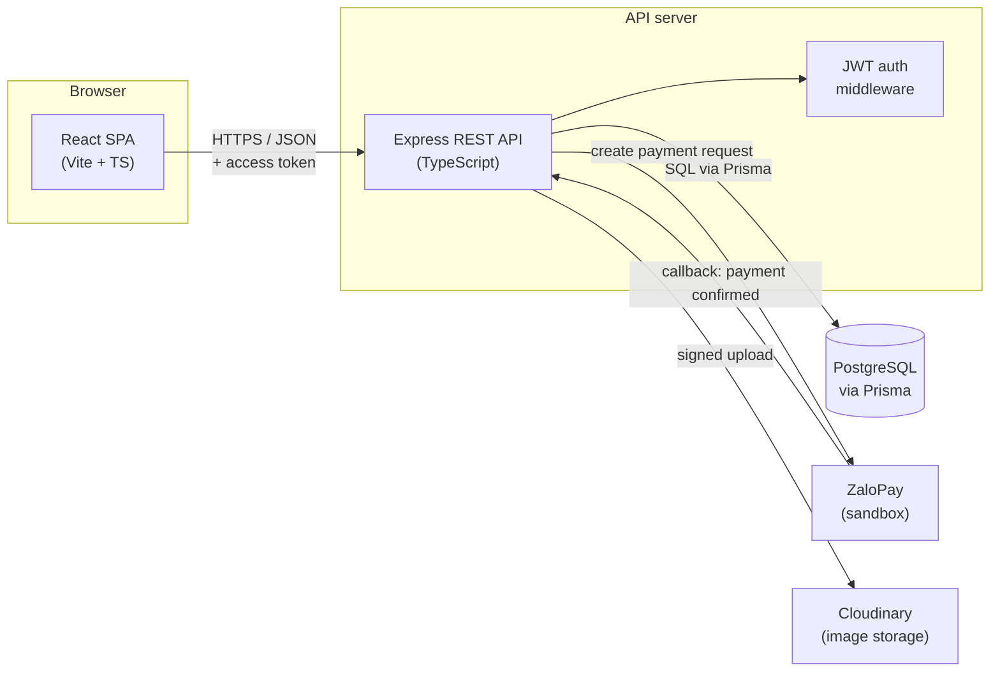

# Storefront: Full-Stack E-Commerce Build Plan

A scoped, seven-week roadmap for a solo portfolio project — built to demonstrate the skills fresher job postings actually ask for, without ballooning into something that never ships.

**Stack:** React + Vite + TypeScript · Node.js + Express + TypeScript · PostgreSQL + Prisma
**Duration:** ~7 weeks, part-time (8–10 hrs/week)
**Scope:** Solo / CV portfolio project — multi-vendor marketplace (customers, sellers, admin)

---

## Table of contents

1. [Overview](#1-overview)
2. [Tech stack](#2-tech-stack)
3. [Architecture](#3-architecture)
4. [Database schema](#4-database-schema)
5. [Feature scope](#5-feature-scope)
6. [API design](#6-api-design)
7. [Folder structure](#7-folder-structure)
8. [Build timeline](#8-build-timeline)
9. [Testing strategy](#9-testing-strategy)
10. [Deployment](#10-deployment)
11. [CV presentation](#11-cv-presentation)

---

## 1. Overview

**Goal.** Build one cohesive application — a small online marketplace — that touches every skill a junior full-stack listing tends to name: relational data modeling, a REST API, authentication and authorization across multiple roles, third-party integration, and a deployed, demoable frontend. E-commerce is chosen specifically because it forces real relationships (users → orders → order items → products) instead of the flat single-table CRUD that most tutorial projects stop at.

**Three roles, not two.** The platform has customers (browse and buy), sellers (apply to open a store, list and fulfill their own products), and admins (approve sellers, oversee the platform). This is the part of the scope that does the most for a fresher CV: it's no longer "CRUD with login," it's authorization scoped by *ownership* — a seller can only ever touch their own products and order items, which is a genuinely common real-world backend problem, not a tutorial one.

**Frontend approach: clone Amazon's UI.** The storefront's layout, IA, and component patterns (nav bar, product grid, PDP layout, cart drawer, checkout steps) are modeled directly on amazon.com rather than designed from scratch. This is a deliberate time trade: skipping original UI/UX decisions frees the majority of build time for backend depth — data modeling, auth, payment/webhook handling, admin logic — which is what a fresher backend-leaning interview actually probes. Visual clone only: no Amazon code, assets, or scraped copy are reused (see [mock data](#mock-data-source) below for where product data actually comes from).

**Audience for the finished thing.** A recruiter or interviewer spending 3–5 minutes on your GitHub and a live link. That means the project is optimized for *legible scope* and a *working demo*, not for feature count.

> **Scope discipline:** the plan below is deliberately sized to be finishable in evenings/weekends by one person. Section 5 splits features into MVP (build these) and Stretch (only if time remains) — resist the urge to start stretch work before the MVP is deployed end-to-end.

---

## 2. Tech stack

| Layer | Choice | Why |
|---|---|---|
| Frontend | React 18 + Vite + TypeScript | Most commonly requested frontend stack in junior listings; Vite keeps the dev loop fast. UI patterns cloned from Amazon to minimize design time (see §1) |
| Server state | TanStack Query | Separates "data from the server" from "local UI state" — a distinction interviewers like to probe |
| Client state | Zustand | Small store for cart/UI state; avoids prop-drilling without Redux ceremony |
| Styling | Tailwind CSS | Fast to build a polished-looking storefront without hand-rolling a design system |
| Backend | Node.js + Express + TypeScript | Ubiquitous, easy to explain line-by-line in an interview |
| ORM | Prisma | Type-safe queries and migrations; schema file doubles as living documentation of the DB |
| Database | PostgreSQL | Relational integrity for orders/inventory; the DB most fresher roles expect familiarity with |
| Auth | JWT (access + refresh) + bcrypt | Demonstrates hashing, token expiry, and refresh-flow security basics |
| Validation | Zod | One schema shared by form validation and API input validation — shows DRY thinking |
| Payments | ZaloPay (sandbox) | A real Vietnamese payment-gateway integration (redirect checkout + signed server-to-server callback) in sandbox mode — zero real money at risk, and shows callback signature verification |
| Images | Cloudinary free tier | Handles upload + resize without standing up your own object storage |
| Testing | Vitest + Supertest + React Testing Library | Unit, API-integration, and component tests — three levels, on one CV line |
| CI | GitHub Actions | Lint + test on every push; a green badge on the README reads as professional habit |
| Hosting | Render/Railway (API+DB) + Vercel (client) | Free tiers, both give you a public URL to put on the CV itself |

---

## 3. Architecture

A conventional three-tier layout: an SPA talking to a single REST API, which is the only thing that touches the database and third-party services.



The frontend never talks to ZaloPay or Cloudinary directly — it goes through the API, which keeps secret keys server-side only and only ever hands the browser a redirect URL for payment.

---

## 4. Database schema

Thirteen tables — enough to require real foreign keys, ownership-scoped authorization, and a couple of many-to-many relationships, without turning migration work into a project on its own.

```mermaid
erDiagram
  USERS ||--o{ ADDRESSES : has
  USERS ||--o{ ORDERS : places
  USERS ||--o{ REVIEWS : writes
  USERS ||--o| CARTS : owns
  USERS ||--o| SELLERS : "may operate"
  SELLERS ||--o{ PRODUCTS : lists
  SELLERS ||--o{ ORDER_ITEMS : sells
  SELLERS ||--o{ SHIPMENTS : creates
  CATEGORIES ||--o{ PRODUCTS : groups
  PRODUCTS ||--o{ PRODUCT_IMAGES : has
  PRODUCTS ||--o{ CART_ITEMS : "referenced by"
  PRODUCTS ||--o{ ORDER_ITEMS : "referenced by"
  PRODUCTS ||--o{ REVIEWS : receives
  CARTS ||--o{ CART_ITEMS : contains
  ORDERS ||--o{ ORDER_ITEMS : contains
  ORDERS ||--o{ SHIPMENTS : "split into"
  ORDERS ||--|| PAYMENTS : "settled by"
  ORDERS }o--|| ADDRESSES : "ships to"
  SHIPMENTS ||--o{ ORDER_ITEMS : covers

  USERS {
    uuid id PK
    string email UK
    string password_hash
    string role "customer, seller, or admin"
    timestamp created_at
  }
  SELLERS {
    uuid id PK
    uuid user_id FK UK
    string applicant_name
    string national_id_masked "demo only, see security note"
    string business_name
    string slug UK
    text description
    string address_line1
    string city
    string postal_code
    string country
    string status "pending, approved, rejected, suspended"
    timestamp created_at
  }
  ADDRESSES {
    uuid id PK
    uuid user_id FK
    string line1
    string city
    string postal_code
    string country
  }
  CATEGORIES {
    uuid id PK
    string name
    string slug UK
  }
  PRODUCTS {
    uuid id PK
    uuid seller_id FK
    uuid category_id FK
    string name
    string slug UK
    text description
    int price_cents
    int stock_qty
  }
  PRODUCT_IMAGES {
    uuid id PK
    uuid product_id FK
    string url
    int sort_order
  }
  CARTS {
    uuid id PK
    uuid user_id FK
  }
  CART_ITEMS {
    uuid id PK
    uuid cart_id FK
    uuid product_id FK
    int quantity
  }
  ORDERS {
    uuid id PK
    uuid user_id FK
    uuid shipping_address_id FK
    string status
    int total_cents
    timestamp created_at
  }
  ORDER_ITEMS {
    uuid id PK
    uuid order_id FK
    uuid product_id FK
    uuid seller_id FK
    uuid shipment_id FK "nullable until store confirms"
    int quantity
    int unit_price_cents
  }
  SHIPMENTS {
    uuid id PK
    uuid order_id FK
    uuid seller_id FK
    string carrier "optional, free text"
    string tracking_number "optional"
    string status "confirmed, packed, received"
    timestamp confirmed_at
    timestamp packed_at
    timestamp received_at
  }
  PAYMENTS {
    uuid id PK
    uuid order_id FK
    string zalopay_app_trans_id UK "our own transaction id, sent to ZaloPay; how the callback is matched back to an order"
    string zalopay_txn_id "ZaloPay's own transaction id, only known once the callback arrives"
    string status
  }
  REVIEWS {
    uuid id PK
    uuid product_id FK
    uuid user_id FK
    int rating
    text comment
  }
```

**Design notes:**
- Prices are stored as integer cents to avoid floating-point rounding bugs — a detail worth mentioning in an interview.
- `order_items.unit_price_cents` **and** `order_items.seller_id` are both copied from the product at purchase time, not joined live — so a historical order stays correct even after a product's price changes *or* it gets reassigned/removed. This denormalization is also what makes "show me this seller's orders" a single indexed `WHERE seller_id = ?` instead of a multi-table join through products.
- `SELLERS` is a 1:1 extension of `USERS` (one row per user who has applied to sell), not a replacement for the users table — a seller still logs in and checks out as a normal user. `status` gates whether their products are publicly visible: only `approved` sellers' products should appear in `/api/products`.
- One order can legitimately contain items from several sellers (a normal marketplace cart). Rather than a status field on each line item, fulfillment is modeled as its own entity: `SHIPMENTS` is one row per **(order, seller)** pair — each seller's items in an order ship as one unit. `ORDER_ITEMS.shipment_id` starts `null` and gets set once that seller acts on the order, so a single order can show one seller's items as `received` while another's are still `confirmed`.
- `SHIPMENTS.status` has exactly three values — `confirmed` → `packed` → `received` — moved forward manually by the seller through their dashboard (`PATCH /api/sellers/me/shipments/:id`). There is no real carrier in this project (no packages actually move), so nothing updates this automatically; see the note below.
- The seller's initial product list is submitted *with* the application, not after approval. `POST /api/sellers/apply` creates the `SELLERS` row (`status = pending`) and the submitted `PRODUCTS` rows in one transaction, all pointing at that `seller_id`. Product visibility stays gated purely by `sellers.status = approved` (per the rule above), so nothing extra is needed to keep a pending seller's catalog hidden — the admin reviews identity, business info, and the proposed catalog together as one package.

> **Security/privacy note on `national_id`:** collecting a real government ID number is sensitive PII with real handling obligations (encryption at rest, access logging, retention limits) that are out of scope for a portfolio project — and a genuine liability if this gets deployed to a public URL for a CV link. Treat the field as a **demo simulation**: validate as digits-only with no length limit (Zod: `z.string().regex(/^\d+$/)`) — no real national ID format is enforced, since none of this is a real verification. Never return it in full from any API response (mask to last 4 digits, e.g. `national_id_masked`), never log it, and put a visible disclaimer on the application form ("Demo project — do not enter a real ID number"). This is worth a line in the README too; it reads as security awareness, not as a gap.

> **Design note on manual shipment status:** in a real marketplace, a carrier (DHL/UPS/USPS) is usually the source of truth for shipment status, pushed in via a webhook or polled from a tracking API (services like EasyPost or Shippo exist to normalize this across carriers). No real packages exist here, so that's out of scope — the store self-reports status by hand, same as how a small independent seller on a real marketplace operates before they're large enough to warrant carrier API integration. Worth stating this explicitly in the README as a scoped decision, not a gap.

### Mock data source

Don't hand-author catalog data — seed it so effort stays on the backend, not on writing fake product copy. Two viable approaches, and the project uses the second:

| Source | What you get | Effort |
|---|---|---|
| **[DummyJSON](https://dummyjson.com/products)** / **Kaggle Amazon datasets** | Real product titles, prices, ratings, image URLs | Fetch/download, parse, map columns to schema — but neither dataset has a concept of "seller," so every product still needs to be fabricated-assigned to one of your own seeded sellers anyway |
| **`@faker-js/faker`, fully synthetic** (implemented) | Full control over volume and shape — sellers, categories, and products generated together so they're consistent with each other from the start | Generate everything directly in `prisma/seed.ts`, no external file/network dependency |

Given the marketplace now needs 500 sellers that don't exist in any public dataset, a pure-Faker seed ended up simpler than bolting seller assignment onto borrowed data — so that's what [`server/prisma/seed.ts`](server/prisma/seed.ts) does, run via `prisma db seed`:

- **12 categories**, each with its own noun pool (e.g. Electronics → Laptop, Smartwatch, Router…) so generated names stay thematically on-topic and a category filter or search box returns results that actually make sense together.
- **500 sellers**, each backed by a real `USERS` row (`role: seller`) and round-robin assigned one "home" category, so a seller's storefront page reads as a coherent shop rather than a random mix of unrelated goods.
- **1,200 products** (100 per category — comfortably over the >1,000 target), each with a unique slug, price, stock quantity, one deterministic placeholder image (`picsum.photos/seed/<slug>/…`, so re-running the seed always produces the same images), and a random 0–6 reviews from a pool of 40 demo customer accounts.
- One `admin@storefront.dev` account and every seeded account share one bcrypt hash of a fixed demo password — hashing per-account would make a 500+ user seed take minutes instead of seconds; never do this for a real signup/reset flow.
- The script wipes all tables in FK-safe order before reseeding, so it's safe to re-run any time during development.

`server/prisma/schema.prisma` mirrors the ERD above exactly (camelCase fields, `@map`'d back to the snake_case column names shown in the diagram). Don't scrape amazon.com directly for this project if you later want to mix in real listings — DummyJSON and published Kaggle datasets are already cleared for reuse and sidestep that entirely.

---

## 5. Feature scope

MVP is the whole demo — build and deploy it end-to-end before touching anything in the stretch column.

### MVP — ship this

**Customer**
- Register / login / logout with JWT access + refresh tokens
- Product catalog: list, detail page, category filter, text search, pagination
- Cart: add / update quantity / remove, persisted per logged-in user — items may come from multiple sellers
- Checkout: shipping address form, order summary, ZaloPay sandbox payment
- Order history: customer can view past orders, with each seller's shipment shown separately (`confirmed` / `packed` / `received`)
- Reviews: leave a star rating + comment on a product

**Seller**
- Apply to sell: a single application form — applicant name, national ID (demo-only, see §4 security note), store name, business address, and an initial list of products with price — submitted together and created as `status = pending`
- Seller dashboard: CRUD on *their own* products only (ownership check on every write)
- Seller storefront page: public page at `/sellers/:slug` listing that seller's products
- Seller order view: see order items that belong to them; confirm the order, then move the shipment through `packed` → `received` manually

**Admin**
- Approve / reject / suspend seller applications
- CRUD on categories; can moderate any product
- View all orders across all sellers

### Stretch — only if time remains

- Wishlist / save-for-later
- "Related products" on the product detail page
- Discount / coupon codes at checkout
- Order-confirmation email via Resend or Nodemailer
- Seller payouts (real marketplaces split payment at the processor level — ZaloPay doesn't offer a Stripe-Connect-style split-payment product, so this would mean the platform collects the full amount and reconciles/pays sellers out-of-band; worth reading about even if not built)
- Admin analytics: a small revenue/orders-over-time chart, per-seller breakdown
- Playwright end-to-end smoke test for the full checkout flow

### Explicitly out of scope

Say so in the README so it reads as a decision, not a gap: real payout processing / commission handling, real carrier tracking / webhook integration (shipment status is store-entered, not carrier-verified), multiple staff accounts per seller, multi-currency/i18n, native mobile app, horizontal scaling / caching layer.

---

## 6. API design

Conventional REST — resource-based paths, standard status codes, JWT bearer auth on anything user-specific.

| Method | Path | Auth | Purpose |
|---|---|---|---|
| POST | `/api/auth/register` | — | Create account |
| POST | `/api/auth/login` | — | Issue access + refresh token |
| POST | `/api/auth/refresh` | Refresh token | Rotate access token |
| GET | `/api/products` | — | List products from *approved* sellers (filter, search, paginate) |
| GET | `/api/products/:slug` | — | Product detail + reviews |
| POST | `/api/sellers/apply` | User | Submit application: identity, business info, address + initial product list; creates `SELLERS` + `PRODUCTS` rows as `pending` in one transaction |
| GET | `/api/sellers/:slug` | — | Public seller storefront: business info + their products |
| GET | `/api/sellers/me` | Seller | My seller profile + status |
| GET | `/api/sellers/me/products` | Seller | My products (any status, for my own dashboard) |
| POST | `/api/sellers/me/products` | Seller (approved) | Create a product under my store |
| PATCH | `/api/sellers/me/products/:id` | Seller (owner only) | Update my product |
| DELETE | `/api/sellers/me/products/:id` | Seller (owner only) | Remove my product |
| GET | `/api/sellers/me/orders` | Seller | Order items belonging to my store, grouped by order |
| POST | `/api/sellers/me/shipments` | Seller (owner only) | Confirm an order: create a shipment covering my items in it, `status = confirmed` |
| PATCH | `/api/sellers/me/shipments/:id` | Seller (owner only) | Advance status: `confirmed` → `packed` → `received` |
| GET | `/api/sellers/me/shipments` | Seller | List my shipments across orders |
| GET | `/api/admin/sellers` | Admin | List seller applications |
| PATCH | `/api/admin/sellers/:id/status` | Admin | Approve / reject / suspend a seller |
| POST | `/api/products` | Admin | Create product (platform-owned / moderation) |
| PATCH | `/api/products/:id` | Admin | Update or moderate any product |
| DELETE | `/api/products/:id` | Admin | Remove any product |
| GET | `/api/cart` | User | Get current cart |
| POST | `/api/cart/items` | User | Add item to cart |
| PATCH | `/api/cart/items/:id` | User | Change quantity |
| DELETE | `/api/cart/items/:id` | User | Remove item |
| POST | `/api/orders` | User | Create order; server creates a ZaloPay payment request and returns the gateway's redirect URL |
| GET | `/api/orders` | User | List my orders |
| GET | `/api/orders/:id` | User | Order detail, with each seller's shipment (and its status) nested per group of items |
| PATCH | `/api/orders/:id/status` | Admin | Update order status |
| POST | `/api/payments/zalopay/callback` | ZaloPay mac | ZaloPay's server-to-server payment confirmation; verify mac, mark payment + order paid |
| POST | `/api/products/:id/reviews` | User | Leave a review |

---

## 7. Folder structure

One repo, two apps, one shared package for the Zod schemas both sides validate against.

```
storefront/
├── client/                  # React + Vite + TS
│   ├── src/
│   │   ├── pages/           # Home, Product, Cart, Checkout, Orders, Seller/*, Admin/*
│   │   ├── components/
│   │   ├── hooks/           # useCart, useAuth, useProducts, useSellerOrders (TanStack Query)
│   │   ├── store/           # Zustand: cart + ui state
│   │   ├── api/              # typed fetch wrappers
│   │   └── main.tsx
│   └── vite.config.ts
├── server/                  # Express + TS
│   ├── src/
│   │   ├── routes/          # auth.ts, products.ts, sellers.ts, shipments.ts, cart.ts, orders.ts, admin.ts, payments.ts
│   │   ├── controllers/
│   │   ├── middleware/      # auth.ts, requireRole.ts, requireOwnership.ts, errorHandler.ts, validate.ts
│   │   ├── services/        # zalopay.ts, cloudinary.ts
│   │   └── index.ts
│   ├── prisma/
│   │   ├── schema.prisma
│   │   ├── migrations/
│   │   └── seed.ts
│   └── spec/
├── shared/
│   └── schemas/             # Zod schemas imported by both client and server
├── docker-compose.yml        # postgres + api + client for local dev
└── .github/workflows/ci.yml
```

---

## 8. Build timeline

Seven weeks at evenings-and-weekends pace (roughly 8–10 hrs/week). Compress or stretch proportionally to your own schedule — the order of phases matters more than the calendar dates. The seller dashboard gets its own week (Week 5) rather than being squeezed into an existing one — ownership-scoped CRUD is the single most interview-relevant piece of this project and deserves the time.

### Week 1 — Foundations
Repo scaffold (client/server/shared), Prisma schema + first migration (incl. `SELLERS`, `SHIPMENTS`, and `ORDER_ITEMS.seller_id`/`shipment_id`), run `prisma/seed.ts` to generate the 500-seller / 1,200-product catalog (see [§4 Mock data source](#mock-data-source)), Express skeleton, register/login/refresh endpoints with bcrypt + JWT, three-role model (`customer` / `seller` / `admin`).
**Deliverable:** auth works end-to-end via curl/Postman, DB has a realistic catalog.

### Week 2 — Catalog & seller application API
Product & category CRUD scoped by `seller_id`, search/filter/pagination query params, `requireRole`/`requireOwnership` middleware, the seller application endpoint (identity + business + address + initial product batch, created transactionally as `pending`) with Zod validation, admin approval endpoint, image upload to Cloudinary, API-level tests with Supertest covering the ownership boundary (seller A cannot edit seller B's product) and the transaction (a failed product row rolls back the whole application).
**Deliverable:** full product + seller-application API, covered by tests.

### Week 3 — Storefront UI
React app shell, routing, product listing + detail pages wired to the real API via TanStack Query, login/register forms, protected routes, public seller storefront page (`/sellers/:slug`).
**Deliverable:** can browse the catalog, view a seller's page, and log in.

### Week 4 — Cart & checkout
Cart API + Zustand-backed cart UI (naturally supports items from multiple sellers), checkout page (address form + order summary), server-side ZaloPay payment-request creation with a redirect-to-gateway flow, and the signed callback handler that finalizes the order and stamps each `order_item.seller_id` once payment is confirmed.
**Deliverable:** a sandbox ZaloPay payment can complete a real checkout spanning more than one seller.

### Week 5 — Seller dashboard & shipments
Multi-step "Apply to sell" form (identity + business + address + add-products-with-price), seller product CRUD UI for managing the catalog post-approval, seller order view (their line items only) with a confirm-order action and a `confirmed → packed → received` status control, admin seller-approval UI showing the full application (including the proposed catalog) for review.
**Deliverable:** a seller can apply with their initial catalog, get approved, confirm an order, and walk its shipment to `received` — the marketplace loop closes end-to-end.

### Week 6 — Orders, reviews & admin polish
Customer order history showing each seller's shipment status separately, review form + display, admin dashboard rounded out (category CRUD, cross-seller order view, product moderation).
**Deliverable:** every MVP feature is usable from the UI, for all three roles.

### Week 7 — Polish, test, ship
Fill test gaps (especially ownership/authorization cases), fix rough UI edges, set up GitHub Actions CI, deploy API+DB and frontend, write the README (see section 11), record a short demo GIF.
**Deliverable:** live link + polished README, ready to link from a CV.

---

## 9. Testing strategy

Three thin layers rather than one deep one — enough to talk about a testing pyramid in an interview without it becoming its own multi-week project.

| Layer | Tool | Covers |
|---|---|---|
| Unit | Vitest | Pure logic: cart total calculation, price formatting, slug generation |
| Integration | Supertest against a test DB | Real routes: register → login → create product (admin) → add to cart → checkout; **plus** authorization cases — seller A blocked from editing seller B's product or order item |
| Component | React Testing Library | Cart drawer and checkout form — the two places a UI bug would be most embarrassing live |
| E2E (stretch) | Playwright | One smoke test: browse → add to cart → complete a ZaloPay sandbox payment → see order confirmation |

---

## 10. Deployment

Free-tier hosting throughout — the point is a working public URL, not infrastructure sophistication.

- **Local dev:** `docker-compose up` runs Postgres + API + client together so setup is a one-liner for anyone cloning the repo.
- **Database + API:** Render or Railway, free tier, with `DATABASE_URL`, JWT secret, and ZaloPay sandbox credentials as environment variables (never committed).
- **Migrations:** `prisma migrate deploy` run automatically on deploy, not by hand against production.
- **Frontend:** Vercel, pointed at the deployed API's URL via an env var.
- **Payment callback:** ZaloPay calls back over plain HTTPS to a publicly reachable URL — point the sandbox dashboard at the deployed `/api/payments/zalopay/callback` endpoint; while developing locally, tunnel with `ngrok http 4000` (or similar) and register the tunnel URL, since ZaloPay has no Stripe-CLI-style local event forwarder.

---

## 11. CV presentation

The code is only half the deliverable — how it's presented is what a recruiter actually spends time on.

### README checklist

- [ ] One-paragraph problem statement: what the app does and who it's for
- [ ] Live demo link, front and center, above the fold
- [ ] 2–3 screenshots or a short GIF of the checkout flow
- [ ] Tech stack list (or badges) matching section 2
- [ ] The architecture diagram from section 3, or a simplified version of it
- [ ] Local setup instructions that actually work on a clean clone
- [ ] A short "What I'd do differently at scale" section — shows self-awareness beyond the project's own scope

### Resume bullet, as a starting point

> "Built and deployed a full-stack multi-vendor marketplace (React, TypeScript, Node.js, PostgreSQL) with role-based auth for customers, sellers, and admins, ownership-scoped seller dashboards, a ZaloPay sandbox checkout spanning multiple sellers per order, and an admin approval workflow; covered core flows and authorization boundaries with unit, integration, and component tests, and wired up CI via GitHub Actions."

Adjust for the specific role you're applying to — lead with the API/data-modeling half for backend-leaning postings, or the React/state-management half for frontend-leaning ones.

---

*Plan scoped for a solo, fresher-portfolio build. Adjust week-by-week pacing to your own availability — the phase order is the part worth keeping fixed.*
