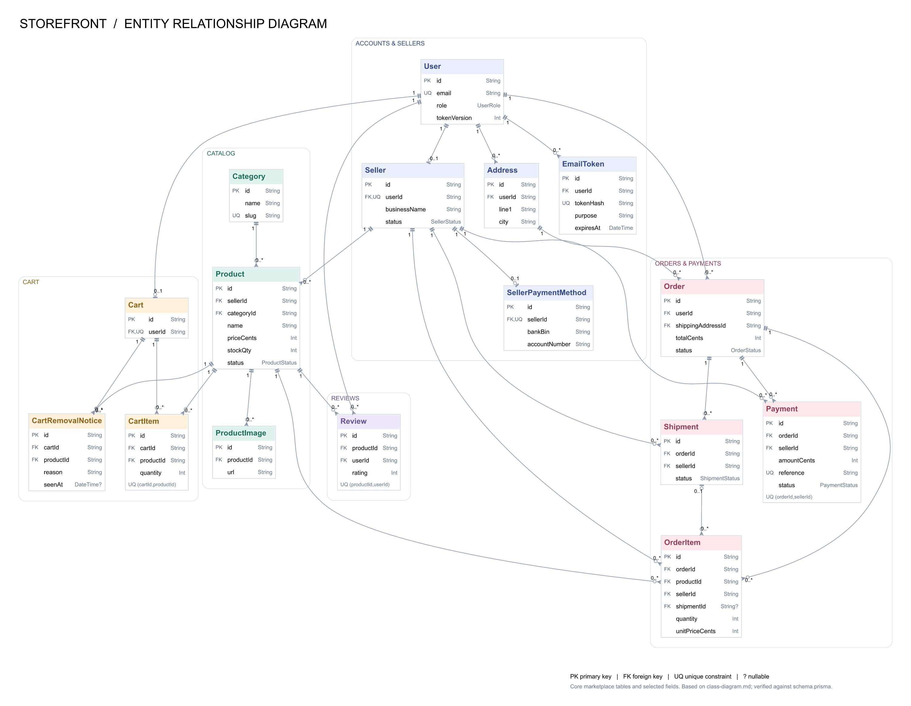

# Storefront

A multi-vendor marketplace where customers shop, sellers manage products and payments, and admins moderate the platform.  
Built with React, TypeScript, Express, Prisma and PostgreSQL.  
Supports carts, orders, per-seller VietQR payment confirmation and reviews; local payments use fictional demo details.

[](docs/images/storefront-erd.svg)

## Set up and run locally

Requirements: Git, Node.js 24.x, Docker Desktop running with Linux containers, internet access, and free ports **5200, 5201, 5433**.

```sh
git clone https://github.com/TommyK0109/Online-Shopping.git
cd Online-Shopping
npm run setup:local
docker compose up -d --build --wait
docker compose exec api npm run seed --workspace server
```

`setup:local` creates the local `.env` files and random JWT secrets. Docker installs dependencies and applies database migrations automatically. Run the seed only for initial demo setup: it resets the local database.

Open **http://localhost:5200**. API health: http://localhost:5201/health.

Demo accounts: `customer@storefront.dev`, `seller@storefront.dev`, `admin@storefront.dev`. Password for all three: `Password123!`.

```sh
# Stop the project; keep database data
docker compose down

# Start again; no need to seed again
docker compose up -d --wait

# View application logs
docker compose logs -f api client
```
